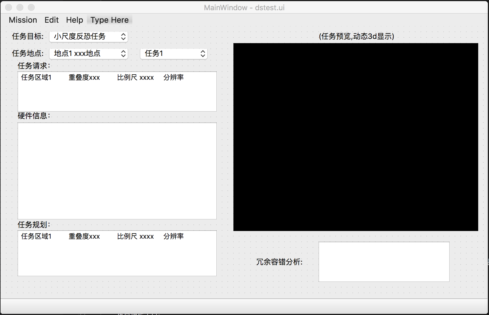

# 7.4之前的一周工作  
概况：  
- 确定软件实施方案
- 软件界面初步确定

## 实施方案
人员：  
- 冯朝晖：跟赵海盟做硬件  
- 崔家梁：软件串联  
- 陈玄同：软件部分细节实现方法研究：3d显示&通信  
- 李芹：学习python  
  
技术实现方案：  
- 语言：python
- 窗体工具： pyqt5

## 初步确定的软件界面

# 计划
7月-8月初：完成软件部分大体框架，能跑几个demo